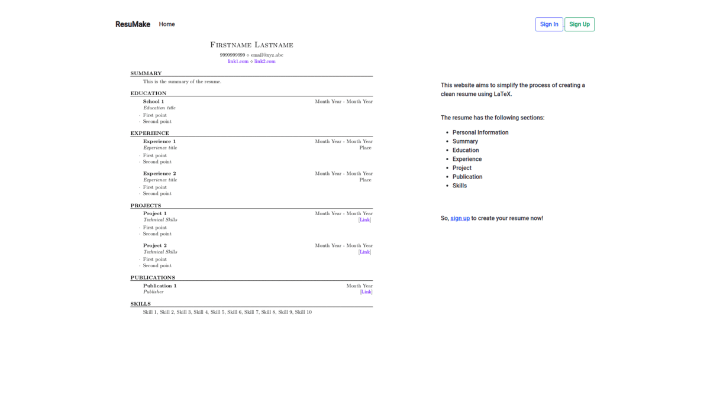

# Resu-Make

A Flask app that aims to ease the process of making a resume in LaTeX by allowing the user to input the required data and generate a properly formatted and clean resume. \
The project includes authorisation process, generates the TEX file, serves the TEX file (hashed URL) for compilation process by a third-party API (latexonline.cc). \
The website is deployed [here](http://resumake.pythonanywhere.com/).

## Preview



## [Sample Resume](preview/sample.pdf)

## Getting Started

1. Fork the repository and then clone the repository locally. Type the following command/s in the terminal. \
   `git clone https://github.com/<YOUR USERNAME>/resumake.git`

2. Navigate to the app directory. Type the following command/s in the terminal. \
   `cd resumake`

3. Create a new virtual environment and install the required Python modules. Type the following command/s in the terminal. \
   `python3 -m venv venv` \
   `source venv/bin/activate` \
   `pip install -r requirements.txt`

4. Create _'env.json'_ file and enter the following environment variables in the file.

   ```JSON
   {
       "SECRET_KEY": "<YOUR SECRET KEY>",
       "DATABASE": "db.sqlite",
       "BASE_URL": "<YOUR BASE URL>"
   }
   ```

   Here,

   1. SECRET_KEY: This is used to sign session cookies of your Flask app.
   2. DATABASE: This is the name of your SQLite database. It will be stored in the _'instance'_ directory of your app.
   3. BASE*URL: This is needed during the compilation part of the app. Note, the compilation part won't work until the app is running locally. Deploy the app online as the TEX file is served by the app and the *'https://latexonline.cc/'_ API fetches the data and returns the compiled PDF.

5. Create _'resumake/hash.py'_ file and define a method _'get_hash'_.

   ```Python
   '''
   Returns the hash of the userid.
   '''
   def get_hash(userid):
       # YOUR CODE HERE


       return hashed_userid
   ```

6. Export the Flask environment variables. Type the following command/s in the terminal. \
   `export FLASK_APP=resumake` \
   `export FLASK_ENV=development` \
   Note, don't export _'FLASK_ENV'_ as 'development' while deploying the application.
7. Initialise the database. This creates a new SQLite database file in the instance directory. Type the following command/s in the terminal. \
   `flask init-db`

8. Run the app. Type the following command/s in the terminal. \
   `flask run`
